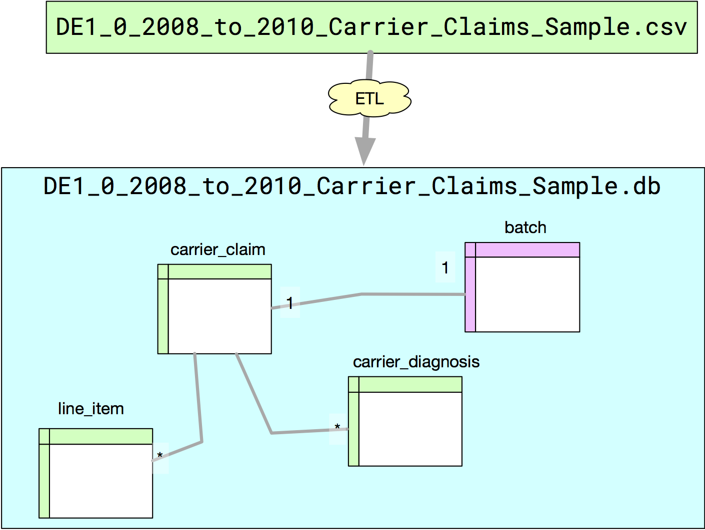

# cms-sqlite-loader

This repository contains  python code to ETL the synthetic PUF from medicare found here: 
  * [CMS Synthetic PUF](https://www.cms.gov/Research-Statistics-Data-and-Systems/Downloadable-Public-Use-Files/SynPUFs/index.html)

This ETL code creates a 1-to-1 mapping between a CMS PUF artifact file (a CSV), and a SQLite .db file.

 
# Motivation

A CMS Synthetic PUF Claims file has all the data needed to do analysis.  However it comes in a slightly inconvenient format for querying at the cost for a universally known format: CSV.

Sqlite is a powerful embeddable database that allows complete access to the entirety of the SQL specification, and stores all its data in a single file that is 100% portable from sysyste  to system. This last quality allows us to do the following: 

Here our ETL code maps from one serialization (a CSV file) to another (a SQLite db file).

